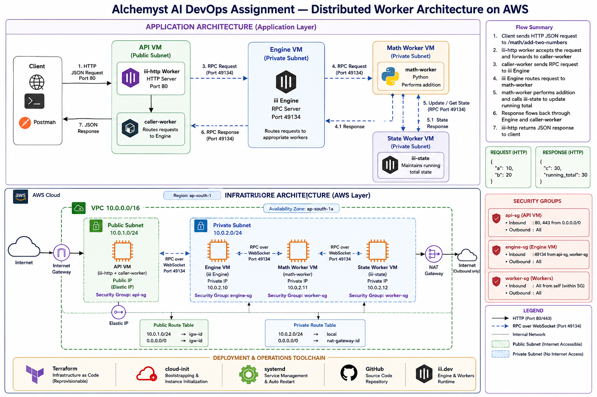
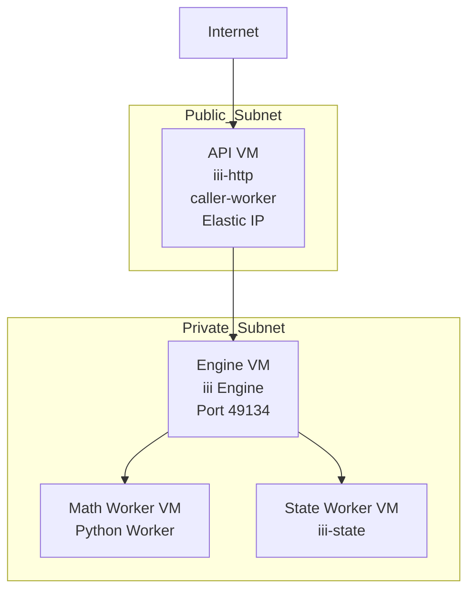
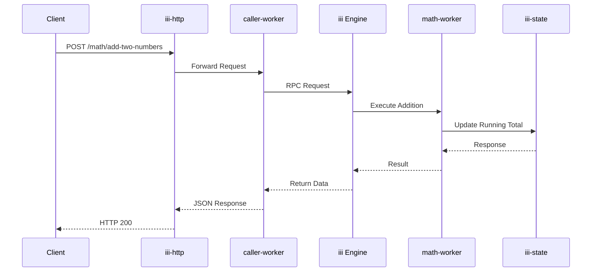

# Alchemyst AI — DevOps Internship Assignment

This repository contains the infrastructure and deployment automation for the Alchemyst AI DevOps Internship Assignment.

The solution deploys the `quickstart` distributed worker system across multiple EC2 instances inside a private AWS subnet using Terraform.

Features included:

- Distributed worker deployment
- Private RPC communication
- Public JSON API endpoint
- Infrastructure as Code using Terraform
- Automated VM bootstrap using cloud-init/user_data
- systemd based service management
- Secure network isolation
- Reproducible deployments

---

# Architecture Overview

Combined Infrastructure and Application architecture diagram:



The architecture demonstrates:

- Public API exposure
- Private worker mesh
- RPC communication flow
- iii Engine orchestration
- Network segmentation
- Secure worker isolation
- Request processing pipeline

---

# Infrastructure Architecture



---

# Application Architecture



---

# AWS Resources Provisioned

| Resource | Purpose |
|----------|----------|
| VPC | Isolated network |
| Public Subnet | API exposure |
| Private Subnet | Internal workers |
| Internet Gateway | Public access |
| NAT Gateway | Outbound internet |
| Route Tables | Traffic routing |
| Security Groups | Network isolation |
| EC2 Instances | Worker deployment |
| Elastic IP | Stable API endpoint |
| IAM Roles | SSM access |

---

# Infrastructure Layout

| VM | Role | Subnet |
|----|------|--------|
| api-vm | iii-http + caller-worker | Public |
| engine-vm | iii Engine | Private |
| math-vm | Python worker | Private |
| state-vm | iii-state | Private |

---

# Security Design

## Public Components

Only API VM is reachable from the internet.

Allowed ingress:

- HTTP 80
- HTTPS 443

API traffic:

```text
Internet
    ↓
API VM
```

---

## Private Components

Worker nodes remain isolated:

- engine-vm
- math-vm
- state-vm

These instances:

- have no public IP
- stay inside private subnet
- communicate internally only

RPC port:

```text
49134/tcp
```

---

# Repository Structure

```text
.
├── terraform/
│
├── main.tf
├── variables.tf
├── outputs.tf
├── provider.tf
├── versions.tf
├── terraform.tfvars
│
├── modules/
│   ├── network/
│   ├── security-groups/
│   └── ec2/
│
├── userdata/
│   ├── api.sh
│   ├── engine.sh
│   ├── math.sh
│   └── state.sh
│
├── app/
│
├── docs/
│   └── architecture.png
│
└── README.md
```

---

# Deployment Prerequisites

Install:

- Terraform >= 1.5
- AWS CLI
- Git

Configure credentials:

```bash
aws configure
```

Validate access:

```bash
aws sts get-caller-identity
```

---

# Deployment Steps

## Clone Repository

```bash
git clone <repo-url>

cd alchemyst-devops-assignment
```

---

## Initialize Terraform

```bash
cd terraform

terraform init
```

---

## Validate

```bash
terraform validate
```

---

## Review Plan

```bash
terraform plan
```

---

## Deploy Infrastructure

```bash
terraform apply -auto-approve
```

Terraform provisions:

- VPC
- Public subnet
- Private subnet
- NAT Gateway
- Route tables
- Security groups
- IAM roles
- Elastic IP
- EC2 instances

Bootstrap scripts automatically:

- install dependencies
- clone quickstart
- configure workers
- create systemd units
- start services

Deployment duration:

```text
5–10 minutes
```

---

# Retrieve API Endpoint

Get API IP:

```bash
terraform output api_public_ip
```

Example:

```text
13.xxx.xxx.xxx
```

---

# API Usage

Endpoint:

```text
POST /math/add-two-numbers
```

---

# Sample Request

```bash
curl -X POST http://<API_PUBLIC_IP>/math/add-two-numbers \
-H "Content-Type: application/json" \
-d '{
"a":10,
"b":20
}'
```

---

# Sample Response

```json
{
  "c":30,
  "running_total":30
}
```

---

# Service Validation

Open SSM session:

```bash
aws ssm start-session \
--target <instance-id>
```

Check services:

Engine:

```bash
systemctl status iii-engine
```

Math Worker:

```bash
systemctl status math-worker
```

State Worker:

```bash
systemctl status state-worker
```

Caller Worker:

```bash
systemctl status caller-worker
```

HTTP Worker:

```bash
systemctl status http-worker
```

---

# Destroy Infrastructure

```bash
terraform destroy -auto-approve
```

---

# Production Hardening Considerations

## Security Improvements

- Replace EC2 exposure with ALB
- HTTPS via ACM
- AWS WAF
- Secrets Manager
- IAM least privilege
- VPC Flow Logs
- SSM access only

---

## Reliability Improvements

- Multi-AZ deployment
- Auto Scaling Groups
- Health checks
- Self-healing instances
- Immutable AMIs

---

## Observability

- CloudWatch Agent
- Centralized logging
- Metrics dashboard
- Alerting
- Distributed tracing

---

## CI/CD

Recommended:

- GitHub Actions
- Terraform automation
- Drift detection
- Image promotion
- Environment separation

---

# Scaling Strategy for Larger Models

If model size increased significantly:

Infrastructure upgrades:

- GPU instances
- Distributed inference
- Model sharding
- EKS deployment
- Autoscaling workers

Performance upgrades:

- vLLM
- TGI
- Quantization
- Request batching
- Token streaming
- Cache optimization

Platform upgrades:

- Service mesh
- Queue systems
- Vector databases
- Async orchestration
- Multi-region deployment

---

# Design Decisions

## Why EC2?

Assignment requirements explicitly required:

- Multiple VMs
- Worker separation
- Private communication
- RPC networking

EC2 aligned best.

---

## Why systemd?

systemd provides:

- Automatic restart
- Service lifecycle management
- Persistence after reboot
- Operational simplicity

---

## Why Terraform?

Terraform provides:

- Reproducibility
- Declarative infrastructure
- Version control
- Easy teardown/rebuild

---

# Author

Apurva Singh